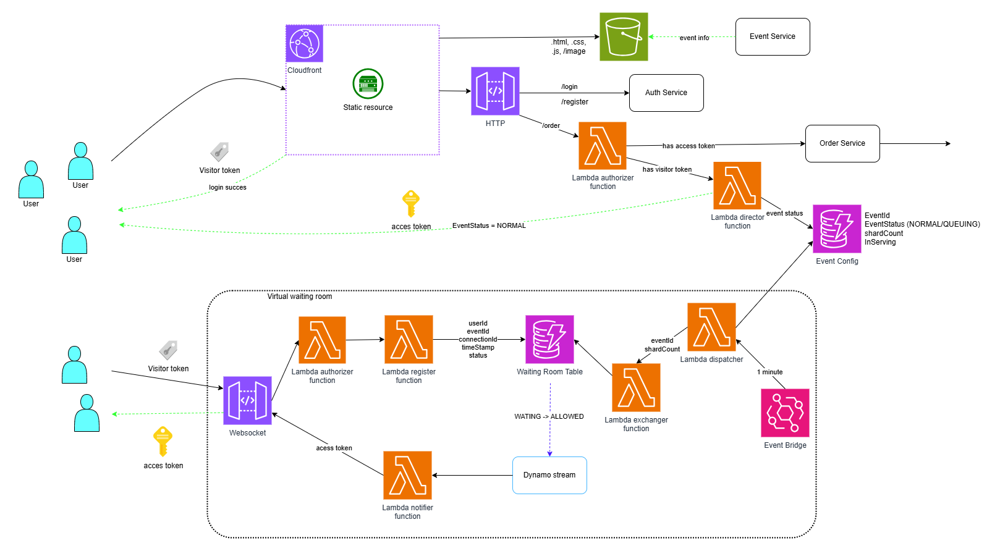

# 🎟️ Spike ticket

## 📖 Giới thiệu
Hệ thống bán vé sự kiện trực tuyến được thiết kế chuyên biệt để xử lý lượng truy cập khổng lồ (traffic spikes) trong các đợt mở bán vé (flash sales). 

Vấn đề lớn nhất của các hệ thống bán vé thông thường là sự cố sập server và lỗi vượt quá số lượng vé (overselling) khi hàng trăm ngàn người dùng truy cập cùng lúc. Dự án này giải quyết bài toán đó bằng cách áp dụng **Kiến trúc Vi dịch vụ (Microservices)** và cơ chế **Phòng chờ ảo (Virtual Waiting Room)**, đảm bảo hệ thống luôn hoạt động ổn định, công bằng và toàn vẹn dữ liệu.

## ✨ Tính năng nổi bật
* **Virtual Waiting Room (Phòng chờ ảo):** Sử dụng để quản lý hàng đợi người dùng. Thay vì đẩy trực tiếp toàn bộ request vào Database, hệ thống sẽ phân luồng và cấp quyền truy cập tuần tự, bảo vệ hệ thống khỏi tình trạng quá tải (Bottleneck).
* **Microservices Architecture:** Hệ thống được chia nhỏ thành các services độc lập (User Service, Ticket Service, Order Service, Payment Service...), giúp dễ dàng mở rộng theo chiều ngang khi lưu lượng tăng cao.
* **Concurrency Control (Kiểm soát đồng thời):** Xử lý triệt để tình trạng Race Condition, đảm bảo tính nhất quán của dữ liệu (ACID) trong quá trình giao dịch, không để xảy ra tình trạng bán số lượng vé nhiều hơn thực tế.
* **Cloud Deployment:** Triển khai hạ tầng và các dịch vụ trên nền tảng đám mây AWS để tối ưu hiệu năng và đảm bảo tính sẵn sàng cao (High Availability).

## 🛠️ Công nghệ sử dụng
* **Backend:** Java, Spring Boot
* **Caching:** Redis
* **Cloud Infrastructure from AWS:** DynamoDB, Lambda Function, API Gateway, S3, ...
* **Frontend:** ReactJS

## 🏗️ Kiến trúc hệ thống
1. Order Service: Thực hiện các logic nghiệp vụ của việc mua vé  
2. Inventory Service: Quản lý kho vé, xử lý Race Condition
3. Payment Service: Xử lý thanh toán
4. Event Service: Quản lý thông tin sự kiện và vé
5. Auth Service: Cấp quyền truy cập và quản lý người dùng
6. Notification Service: Gửi thông báo kèm vé qua email khi giao dịch thành công
7. Check in Service: Xử lý check in quét mã QR và quản lý danh sách khách tham dự
8. Virtual Waiting Room: Quản lý hàng đợi khi lượng người dùng tăng cao  
## Luồng hoạt động chính của Virtual Waiting Room: ##
 
1. Người dùng truy cập trang mua vé. Nếu FE phát hiện chưa đăng nhập/bị trả về token hết hạn => tự động chuyển hướng tới login.  
2. Sau khi có token hợp lệ (visitor token), người dùng ấn vào mua vé được API Gateway HTTP kích hoạt Authorizer Function để xác thực token. Nếu đúng sẽ kích hoạt Director Function. Director kiểm tra trạng thái event(bình thường hay cần xếp hàng)
   2.1. Nếu là bình thường => kiểm tra bảng Event Config xem số người BE đang phục vụ. Nếu chưa vượt ngưỡng => cấp access token, cho phép đi thẳng vào thực hiện mua vé.  
   2.2. Nếu trạn thái đợi đang bật => Trả về response code 429, FE tự động đem sang API Gateway websocket.
2. FE kết nối tới API Gateway Websocket, gửi visitor token để xác thực qua Authorizer Function, Register Function đăng ký thông tin vào DyanmoDB.
3. Người dùng nhận được trạng thái xếp hàng.
4. Event Bridge sau mỗi phút sẽ kích hoạt Dispatcher Function, thực hiện đọc thông tin từ Event Config để xem có event nào đang ở trạng thái xếp hàng không.  
5. Nếu có event đang xếp hàng, Dispatcher sẽ gọi một Exchanger Function ứng với số event đang chờ. Exchanger sẽ tìm trong DynamoDB các bản ghi trong trạng thái WAITING của event đó, chuyển N bản ghi có timeStamp nhỏ nhất(N tùy vào sức tải của backend) sang ALLOWED.  
6. Dynamo stream phát hiện thay đổi này, kích hoạt Notifier Function, tạo ra access token và trả về theo đúng connectionID mà websocket gateway đang duy trì.  
5. FE nhận được message chứa token này sẽ điều hướng về API Gateway HTTP. Lúc này Authorizer Function sẽ cho phép truy cập vào luồng thanh toán và chốt vé.
  

